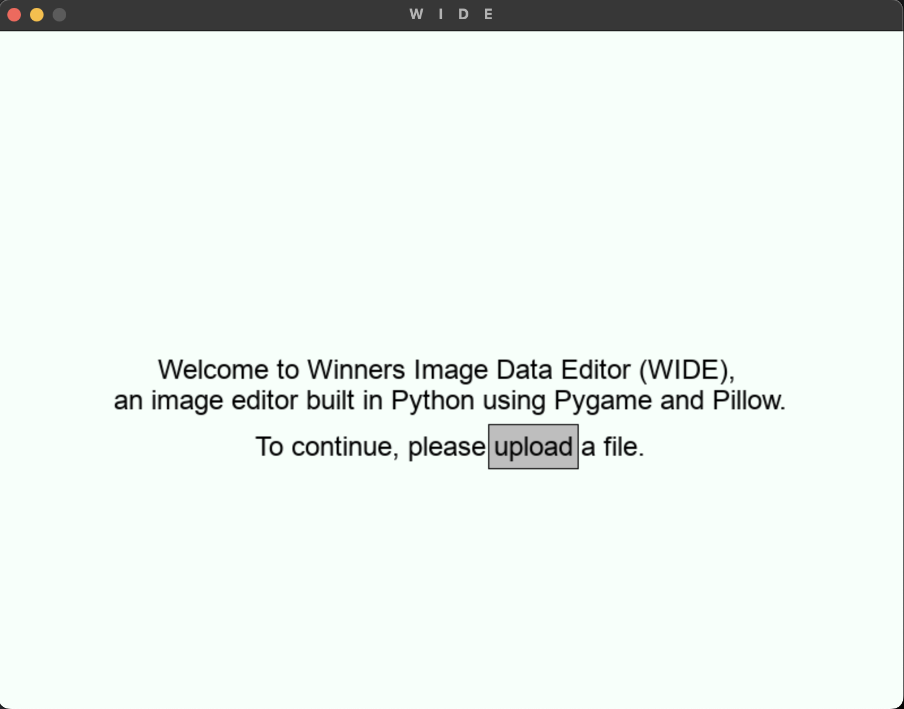

# W Image Data Editor (WIDE)

Welcome to WIDE, our final project for the Tufts Coding Academy 2024. Our team, consisting of Om Mehta, Armaan Thadani, Blake Harper, and Damien Gazen, created this photo editing application using Pygame. WIDE which is GUI based, offers a variety of effects and filters, enabling users to unleash their creativity. The inspiration for this project came from our Image Processing lessons in Track 301 of the course, which was a favorite among all team members.

## Dependencies

You will need to install a few packages in your terminal before running the application. Trust me it's worth it!

Execute the terminal commands below to get started:

``pip install pygame``

``pip install pillow``

``pip install numpy``

or

``pip install pygame pillow numpy``

 <h3>Role of each package</h3>

 * pygame was used mainly to create the UI of the application. It aided us in creating interactive objects such as buttons and allowed us to add conditional actions based on variables extracted from pygame

  * pillow was used for loading and saving images on either the homescreen or the main UI

 * numpy was used to convert images into numpy arrays, enabling us to manipulate the image to get maximum precision while developing our effects

## How to Run

<h3>First Install the zip file in our repository</h3>

<h3>Navigate to the directory that you want to run the project in using</h3>

``cd /path/to/directory``

<h3>Unzip the zip file using</h3>

``unzip WIDE.zip``

This will extract the contents of our project into the current directory.

<h3>If the unzip command is not available on your system, you may need to install it.</h3>

<h4>On Ubuntu or Debian-based systems, you can install it with:</h4>

``sudo apt-get install unzip``

<h4>On macOS, you typically have unzip pre-installed. If not, you can use Homebrew to install it:</h4>

``brew install unzip``

<h4>For Windows, if you’re using the Command Prompt, you can use the built-in powershell command to unzip files:</h4>

``powershell -command "Expand-Archive -Path 'path\to\file.zip' -DestinationPath 'path\to\destination'"``

<h3>Once Unzipped navigate to your terminal and you can then run the project using</h3>

``python main.py``

or

``python3 main.py``

## Interacting with the Project

<h3>After you run the project you should see a page pop up looking like this:</h3>

<h3> Either upload or own file or you can use our sample image to jump right in! </h3>

<h3>After selecting your file or using the sample image you will be redirected to a new window which looks like this</h3>

<h3>Here we have the main photo edit page and heres how to get started with editing your images</h3>

 * move the slider to your desired amount (this would determine the intensity of the effect that you would like to apply)

 * Then select the effect you would like to apply to the image

 * Click "PREVIEW" to see how your image would look like with the effect and if you are happy with it you can click "APPLY" to confirm the effect to apply onto your image

  * Note that you can stack effects on top of each other! and if you want to reset your image to its original you can click "Reset" in the sidebar

 * If you want to export your edited image, click "Save Image" in the menu bar to save it locally on your computer we encourage you to share them with your friends and family

### [PART NAME]
[PART FUNCTION]

### [PART NAME]
[PART FUNCTION]